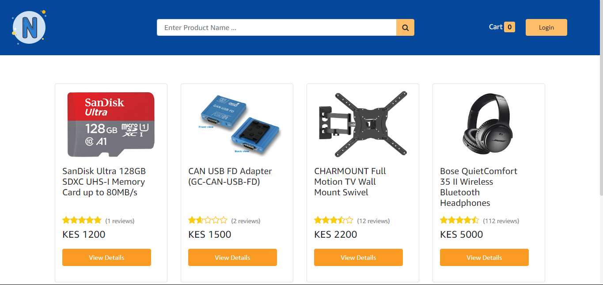

# MERN-Stack-Full-Ecommerce-Site
MERN Stack Full Ecommerce Site - Using React, Redux, Node.js

## Tech stack overview
Below is a brief overview of the tech stack leveraged to bring Avodoc to life.
### Frontend

- `React`
- `Redux`

### Backend

- `Node js`
- `Express`
- `Mongo DB`

### Env Variables
Add your config variables values in the config.env file in backend/config folder
### Install Dependencies (Frontend)
cd frontend
npm i
### Install Dependencies (Backend)
npm i
### Seed Database
Use the following commeand to put some dummy products in that database.
Run it in the root folder.
npm run seeder

# Contribution

All contributions to help improve the application's features and functionalities are welcome. Fork the repository and create a pull request with your modifications. I'll be sure to review them.

# Authors

- Prince Tobit - [Github](https://github.com/tobitprince) / [X](https://twitter.com/tobitprince)  

# License🧾📜

This project is licensed under the MIT License - see the [LICENSE](./LICENSE) file for details.